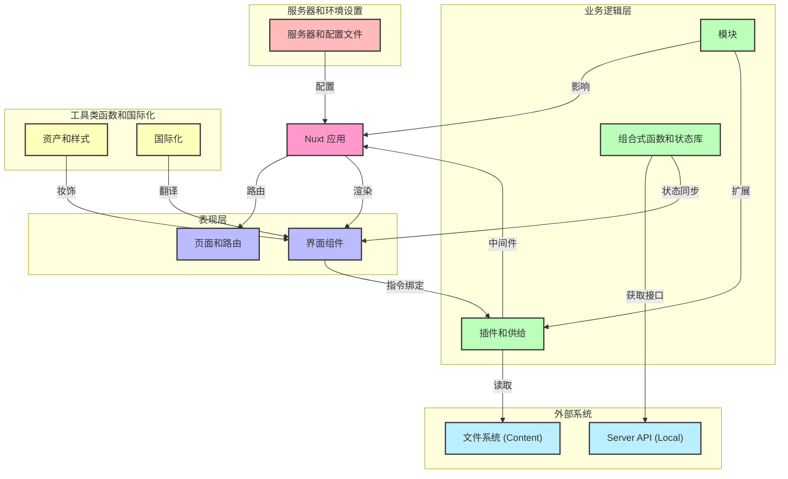

# 项目代号 ｢<ruby>Rei<rp>（</rp><rt>[Nuxt Scaffold]</rt><rp>）</rp></ruby>｣
![State][state-shield]
![Tag][tag-shield]
[![LICENSE-MIT][license-shield]][license-url]

KIRAKIRA 的前端架构复刻版 (Arishi Rei's Blog)

**简体中文** | [English](README_en-US.md)

## 架构图



> [!NOTE] **[架构说明]**
> 当前项目架构基于 Nuxt 4 推荐结构，集成了 Pinia 持久化、Vuetify 组件库、I18n 国际化以及基于文件系统的 Content 生成机制。

## Nuxt

首先，Nuxt 读作 **/nʌkst/**。
查看 [Nuxt 文档](https://nuxt.com/)以了解更多信息。

### 安装

克隆本存储库，您可以使用如下命令，或其他 Git 兼容工具。
```bash
git clone <repository-url>
```

完成克隆后，在程序根目录执行以下命令安装依赖包。

```bash
pnpm install
```

### 开发服务器

> [!NOTE] **[未来扩展] 多环境支持**
> 当前项目尚未集成完整的环境区分（如本地后端/线上后端切换）。
> **迁移计划**：计划引入 `cross-env` 并配置 `.env` 策略以支持 `dev-local`、`dev-stage` 等多种启动模式。

目前支持的基础启动模式：

```bash
pnpm dev
```

启动后，您应该能够在这个地址访问：http://localhost:3000/

#### [未来扩展] 与本地后端一起运行

> [!NOTE] **[未来扩展]**
> 当前项目默认使用 Server API (`/server/api`)，尚未分离独立后端服务。
> **迁移计划**：当后端服务独立拆分后，将配置代理转发或 CORS 支持。

#### [未来扩展] 与线上后端一起运行

> [!NOTE] **[未来扩展]**
> 当前项目暂无线上测试环境 (Staging) 或生产环境 (Production) 后端接口。
> **迁移计划**：部署线上服务后，添加 `pnpm dev-stg` 等命令连接远程 API。

#### [未来扩展] 自定义启动命令

> [!NOTE] **[未来扩展]**
> 当前项目尚未配置复杂的环境变量注入逻辑。
> **迁移计划**：参考模板，支持 `VITE_BACKEND_URI` 等环境变量的动态注入。

#### 在移动端网页测试和预览

在启动开发服务器时，默认监听 `localhost`。如需在局域网访问，请使用：

```bash
pnpm dev --host
```

确保手机/平板与您的电脑位于同一个局域网下，然后访问控制台输出的 IP 地址。

### 生产

#### 为生产生成应用程序 (SSG/Prerender)

这将会完整地生成每一个静态路由页面。当前项目配置了 `generateContent` 钩子，会在构建前生成内容索引。

```bash
pnpm generate
```

#### 为生产构建应用程序 (SSR/Server)

这只会构建最小的根路由页面。

```bash
pnpm build
```

#### 本地预览生产版本

```bash
pnpm preview
```

## 其它脚本功能

依次选择菜单 *终端(<ins>T</ins>) > 运行任务...*，然后即可访问其它脚本功能。

### 检查 Lint

```bash
pnpm lint
```

> [!NOTE] **[未来扩展] StyleLint**
> 当前项目仅配置了 ESLint (`@nuxt/eslint`)，尚未配置 StyleLint。
> **迁移计划**：安装 `stylelint` 及相关 Vue/SCSS 插件，并添加 `lint:css` 脚本。

### [未来扩展] 更新缓动值样式

> [!NOTE] **[未来扩展]**
> 当前项目未使用自定义缓动值系统 (`_eases.scss`)。
> **迁移计划**：引入高级动画系统时添加此脚本。

### [未来扩展] 压缩 SVG

> [!NOTE] **[未来扩展]**
> 当前项目暂无自动化 SVG 压缩工作流。
> **迁移计划**：引入 `svgo` 或相关工具。

## 自定义指令（语法糖）

项目利用各种特性、冷知识、甚至修改底层代码等，添加了许多语法糖以方便开发人员使用。

### 水波纹

> [!NOTE] **[部分支持]**
> 当前项目使用了 Vuetify，Vuetify 提供了 `v-ripple` 指令。
> 用法与模板描述基本一致。

```html
<div v-ripple></div>
```

### [未来扩展] 依次动画优先级 (v-i)

> [!NOTE] **[未来扩展]**
> 当前项目未实现 `v-i` 样式注入指令。
> **迁移计划**：编写自定义指令 `plugins/directives.ts`，实现 `--i` CSS 变量的自动绑定。

### [未来扩展] 工具提示 (v-tooltip)

> [!NOTE] **[部分支持]**
> Vuetify 提供了 `v-tooltip` 指令/组件，但语法可能与模板不同。
> **迁移计划**：封装自定义指令以匹配模板语法 `v-tooltip="'text'"`，或直接使用 Vuetify 原生语法。

### 本地化

如果您想要为本项目的本地化提供建议，请发布 Issue。

> [!IMPORTANT]
> **注意：** 翻译文件位于 `app/i18n/locales/`。

#### [未来扩展] 强化语法

> [!NOTE] **[未来扩展]**
> 当前项目使用标准的 Vue I18n 语法 (`$t('key')`)，尚未实现代理对象语法 (`t.key`)。
> **迁移计划**：实现一个 Composer 或 Plugin，通过 Proxy 代理 `$t` 函数以支持点语法访问。

| 功能 | [未来扩展] 强化语法 | 当前可用语法 |
| :--- | :--- | :--- |
| 直接声明 | `t.welcome` | `$t("welcome")` |
| 变量声明 | `t[variable]` | `$t(variable)` |
| 位置参数 | `t.welcome("hello")` | `$t("welcome", ["hello"])` |

### [未来扩展] 组件根节点

> [!NOTE] **[未来扩展]**
> 当前项目未实现 `<Comp>` 全局组件及 `:comp` CSS 别名。
> **迁移计划**：注册全局组件 `Comp` 并在 Vite/PostCSS 配置中添加 CSS 转换规则。

### [未来扩展] 触摸屏禁用 :hover

> [!NOTE] **[未来扩展]**
> 当前项目未配置 `:any-hover` 媒体查询的自动编译。
> **迁移计划**：配置 PostCSS 插件以支持 `:any-hover` 转换。

### [未来扩展] 菜单、浮窗等的双向绑定模型参数

> [!NOTE] **[未来扩展]**
> 当前项目未实现 `v-model` 绑定 `MouseEvent` 的菜单/浮窗组件。
> **迁移计划**：开发 `<ContextMenu>` 和 `<FloatWindow>` 组件，支持通过 `v-model` 传入事件对象定位。

### [未来扩展] 与样式相关的组件 Prop

> [!NOTE] **[未来扩展]**
> 当前项目组件样式主要依赖 Vuetify Props 或标准 CSS 类。
> **迁移计划**：引入 CSS Variables (`--wrapper-size`) 驱动的样式系统，使组件支持通过 CSS 自定义属性控制内部布局。

## IDE

建议使用以下任意平台进行开发：

[](https://code.visualstudio.com/)

## 使用技术

前端开发中所使用了的技术栈有：

[](https://nuxt.com/)
[](https://vuejs.org/)
[](https://vitejs.dev/)
[](https://pinia.vuejs.org/)
[](https://www.typescriptlang.org/)
[](https://vuetifyjs.com/)
[](https://eslint.org/)
[](https://www.npmjs.com/)

## 测试用浏览器

[](https://www.google.cn/chrome/index.html)
[](https://www.microsoft.com/edge/download)

## 格式规范

* **缩进：** 2 Spaces (当前项目配置) / TAB (模板建议)
* **行尾：** LF
* **引号：** 双引号
* **文件末尾**加空行
* **Vue API 风格：** 组合式 (Composition API)

## 贡献者

[](https://github.com/ArishiRei/rei-nuxt-scaffold/graphs/contributors)

<!-- MARKDOWN LINKS & IMAGES -->
[state-shield]: https://img.shields.io/badge/STATE-WIP-orange?style=flat-square
[tag-shield]: https://img.shields.io/badge/TAG-0.1.0-blue?style=flat-square
[license-shield]: https://img.shields.io/badge/LICENSE-MIT-green?style=flat-square
[license-url]: LICENSE
