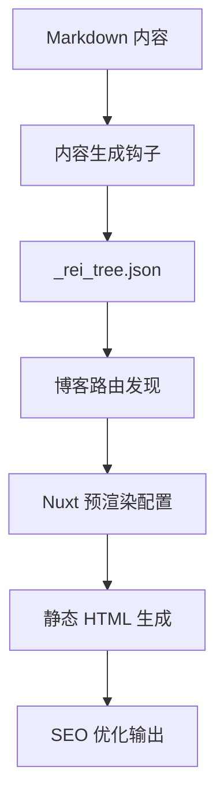

# 技术架构 (Architecture)

## 技术栈
- **Framework**: Nuxt 3 (Vue 3 + TypeScript)
- **UI Library**: Material Web (Material Design 3) + Heroicons (Icons)
- **Rich Text**: TipTap (ProseMirror based)
- **Validation**: Zod (Schema Validation)
- **SEO**: @nuxtjs/seo (Sitemap, Robots, Schema)
- **Linting**: ESLint + Stylelint
- **State Management**: Pinia
- **Styling**: CSS Variables (Design Tokens) + Utility Classes
- **Docs**: Markdown + Nikki0 CLI
- **Static Generation**: 完整的 SSG 支持，包括博客系统静态路由生成

## 目录结构
```text
app/
├── components/     # Vue 组件
│   ├── base/       # 基础组件封装 (Rei*)
│   ├── domain/     # 业务领域组件
│   └── ui/         # 复合 UI 组件
├── composables/    # 组合式函数 (useApi, etc.)
├── pages/          # 页面路由
│   └── blog/       # 博客系统 (静态生成)
├── stores/         # Pinia 状态库
├── utils/          # 工具函数
├── hooks/          # 构建钩子 (路由生成等)
├── types/          # TypeScript 类型定义
└── assets/         # 静态资源与样式
server/
├── api/            # Nitro API & Mock
└── utils/          # 服务端工具函数
docs/               # 项目文档库
scripts/            # 构建和验证脚本
```

## 设计原则
1.  **组件封装**: 禁止直接使用 `md-*`，必须通过 `Rei*` 组件封装，统一风格与 API。
2.  **基础设施复用**: 优先使用现有的 `utils`, `hooks` 和 `stores`。
3.  **Mock 驱动**: 业务开发必须同步实现 Mock 接口，支持无后端开发。
4.  **SSG 优先**: 默认采用静态生成模式部署，博客系统完全静态化。
5.  **类型安全**: 全面的 TypeScript 支持，包括构建时类型检查。

## 博客系统架构

### 静态生成流程


### 核心组件
- **路由生成器** (`app/hooks/gen-blog-routes.ts`): 自动发现和注册博客路由
- **静态页面** (`app/pages/blog/[slug].vue`): 完全静态的博客文章页面
- **类型系统** (`app/types/blog.ts`): 博客相关的 TypeScript 类型定义
- **验证脚本** (`scripts/validate-static-generation.js`): 静态生成质量验证

### 性能特性
- **构建时优化**: 路由发现缓存，预分配数组，早期终止搜索
- **SEO 完整性**: 所有页面包含完整的元数据和结构化数据
- **静态部署**: 支持任何静态托管平台，无服务器依赖

### 验证流程
```bash
pnpm generate          # 生成静态站点
pnpm validate:static   # 验证生成质量
pnpm type-check        # TypeScript 类型检查
```
