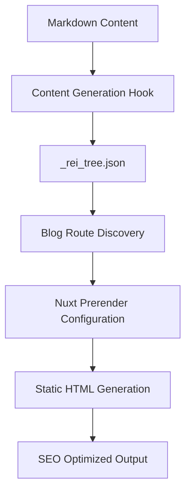

# Technical Architecture

## Technology Stack
- **Framework**: Nuxt 3 (Vue 3 + TypeScript)
- **UI Library**: Material Web (Material Design 3) + Heroicons (Icons)
- **Rich Text**: TipTap (ProseMirror based)
- **Validation**: Zod (Schema Validation)
- **SEO**: @nuxtjs/seo (Sitemap, Robots, Schema)
- **Linting**: ESLint + Stylelint
- **State Management**: Pinia
- **Styling**: CSS Variables (Design Tokens) + Utility Classes
- **Docs**: Markdown + Nikki0 CLI
- **Static Generation**: Complete SSG support, including blog system static route generation

## Directory Structure
```text
app/
├── components/     # Vue components
│   ├── base/       # Base component wrappers (Rei*)
│   ├── domain/     # Business domain components
│   └── ui/         # Composite UI components
├── composables/    # Composable functions (useApi, etc.)
├── pages/          # Page routes
│   └── blog/       # Blog system (static generation)
├── stores/         # Pinia state stores
├── utils/          # Utility functions
├── hooks/          # Build hooks (route generation, etc.)
├── types/          # TypeScript type definitions
└── assets/         # Static resources and styles
server/
├── api/            # Nitro API & Mock
└── utils/          # Server-side utility functions
docs/               # Project documentation library
scripts/            # Build and validation scripts
```

## Design Principles
1.  **Component Encapsulation**: Direct use of `md-*` is prohibited; must use `Rei*` component wrappers for unified style and API.
2.  **Infrastructure Reuse**: Prioritize using existing `utils`, `hooks`, and `stores`.
3.  **Mock-Driven**: Business development must implement Mock interfaces synchronously to support backend-free development.
4.  **SSG First**: Default to static generation mode deployment, with blog system fully staticized.
5.  **Type Safety**: Comprehensive TypeScript support, including build-time type checking.

## Blog System Architecture

### Static Generation Flow


### Core Components
- **Route Generator** (`app/hooks/gen-blog-routes.ts`): Automatically discovers and registers blog routes
- **Static Pages** (`app/pages/blog/[slug].vue`): Fully static blog article pages
- **Type System** (`app/types/blog.ts`): Blog-related TypeScript type definitions
- **Validation Scripts** (`scripts/validate-static-generation.js`): Static generation quality validation

### Performance Features
- **Build-time Optimization**: Route discovery caching, pre-allocated arrays, early termination search
- **SEO Completeness**: All pages include complete metadata and structured data
- **Static Deployment**: Supports any static hosting platform, no server dependencies

### Validation Process
```bash
pnpm generate          # Generate static site
pnpm validate:static   # Validate generation quality
pnpm type-check        # TypeScript type checking
```