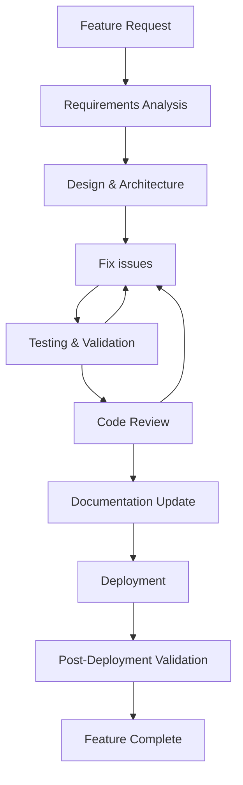

# Development Workflow

This document defines the development processes, Git workflow, and commit standards for the Nuxt 4 project. These workflows implement the [Dynamic Standards Evolution principle](./principles.md#6-dynamic-standards-evolution-self-evolution) and ensure consistent development practices across the team.

## Development Process Overview

### Feature Development Lifecycle



### Development Environment Setup

#### Prerequisites
- Node.js (version specified in `.nvmrc`)
- pnpm package manager
- Git with proper configuration
- IDE with TypeScript and Vue support

#### Initial Setup Process
1. **Clone Repository**: `git clone <repository-url>`
2. **Install Dependencies**: `pnpm install`
3. **Environment Configuration**: Copy `.env.example` to `.env` and configure
4. **Development Server**: `pnpm dev`
5. **Validation**: Run `pnpm lint` and `pnpm build` to ensure setup

## Git Workflow Standards

### Branch Management Strategy

#### Branch Types
- **`main`**: Production branch, always stable and deployable
- **`develop`**: Development integration branch
- **`feature/*`**: Feature development branches
- **`hotfix/*`**: Critical production fixes
- **`release/*`**: Release preparation branches

#### Branch Naming Conventions
```bash
# Feature branches
feature/user-authentication
feature/payment-integration
feature/dashboard-redesign

# Hotfix branches  
hotfix/security-patch
hotfix/critical-bug-fix

# Release branches
release/v1.2.0
release/v2.0.0-beta
```

#### Branch Workflow
1. **Create Feature Branch**: `git checkout -b feature/feature-name develop`
2. **Development**: Make commits following commit standards
3. **Regular Sync**: `git pull origin develop` to stay current
4. **Testing**: Ensure all tests pass before merge
5. **Pull Request**: Create PR to `develop` branch
6. **Code Review**: Address review feedback
7. **Merge**: Squash and merge to `develop`
8. **Cleanup**: Delete feature branch after merge

### Commit Standards

#### Commit Message Format
Follow **Conventional Commits** specification:

```
type(scope): subject

[optional body]

[optional footer]
```

#### Commit Types
- **`feat`**: New feature implementation
- **`fix`**: Bug fix
- **`docs`**: Documentation changes
- **`style`**: Code formatting (no logic changes)
- **`refactor`**: Code restructuring without feature changes
- **`perf`**: Performance improvements
- **`test`**: Test additions or modifications
- **`chore`**: Build process or tool changes

#### Scope Guidelines
- **`auth`**: Authentication and authorization
- **`ui`**: User interface components
- **`api`**: API endpoints and data handling
- **`config`**: Configuration changes
- **`build`**: Build system modifications

#### Commit Message Examples
```bash
# Good commit messages
feat(auth): add OAuth2 login integration
fix(ui): resolve button alignment issue in mobile view
docs(api): update authentication endpoint documentation
refactor(utils): extract common validation functions
perf(api): optimize database query performance

# Bad commit messages
fix: stuff
update code
changes
WIP
```

#### Commit Principles

**Mandatory Commit Policy**
- **Immediate Commit**: Commit after completing each logical unit of work
- **Atomic Commits**: Each commit should represent one logical change
- **No Mixed Changes**: Separate unrelated changes into different commits
- **Pre-commit Validation**: Ensure `pnpm lint` passes before committing

**Windows PowerShell Commands**
```powershell
# Proper command chaining in PowerShell
git add .; git commit -m "feat(ui): add new button component"
pnpm lint; pnpm build; git push origin feature/button-component
```

### Code Review Process

#### Review Requirements
- **Mandatory Reviews**: All code must be reviewed before merging
- **Review Checklist**: Use standardized review checklist
- **Architecture Compliance**: Verify adherence to [architecture standards](./architecture.md)
- **Code Quality**: Ensure [coding standards](./coding-standards.md) compliance

#### Review Checklist
- [ ] Code follows established [coding standards](./coding-standards.md)
- [ ] Architecture aligns with [project structure](./architecture.md)
- [ ] All tests pass and coverage is adequate
- [ ] Documentation is updated for new features
- [ ] No security vulnerabilities introduced
- [ ] Performance impact is acceptable
- [ ] Internationalization is properly implemented
- [ ] Error handling is comprehensive

## Build and Deployment Workflow

### Build Validation Process

#### Development Build Checks
```bash
# Required validation sequence
pnpm lint          # ESLint + Stylelint validation
pnpm build         # SSR/Server build validation  
pnpm generate      # SSG static generation validation
```

#### Build Environment Compatibility
- **Windows PowerShell**: Use `;` for command chaining instead of `&&`
- **Cross-platform**: Ensure scripts work on Windows, macOS, and Linux
- **CI/CD Integration**: Build validation in automated pipelines

#### Static Site Generation (SSG)
- **Primary Mode**: Project defaults to SSG for optimal performance
- **Configuration**: Verify `nuxt.config.ts` generate settings
- **Pre-render Validation**: Ensure all routes generate successfully

### Deployment Process

#### Pre-deployment Checklist
- [ ] All tests pass (`pnpm test`)
- [ ] Linting passes (`pnpm lint`)
- [ ] Build succeeds (`pnpm build`)
- [ ] Static generation works (`pnpm generate`)
- [ ] Environment variables configured
- [ ] Documentation updated
- [ ] Security scan completed

#### Deployment Environments
- **Development**: Automatic deployment from `develop` branch
- **Staging**: Manual deployment from `release/*` branches
- **Production**: Manual deployment from `main` branch

## Documentation Workflow

### nikki0 Documentation System

#### Documentation Lifecycle
1. **Temporary Logging**: Create `docs/_logs/temp.md` during development
2. **Task Completion**: Archive logs using `nikki0` commands
3. **Categorization**: Organize logs by feature and type
4. **Tree Validation**: Verify structure with `nikki0 tree`

#### nikki0 Command Standards
```bash
# Archive development log
nikki0 add -p "docs/_logs/temp.md" -c "feat/editor" --tags "tiptap,editor" --title "Integrate TipTap Editor"

# Verify log structure
nikki0 tree

# Category naming rules (NO Chinese characters)
nikki0 add -c "feat/ui"           # ✅ Good
nikki0 add -c "功能/界面"          # ❌ Bad - Chinese not allowed
```

#### Documentation Categories
- **`feat/`**: New feature implementations
- **`fix/`**: Bug fixes and corrections
- **`refactor/`**: Code restructuring
- **`docs/`**: Documentation updates
- **`chore/`**: Build and tooling changes
- **`perf/`**: Performance improvements

### Documentation Maintenance

#### Synchronization Requirements
- **Code-Documentation Sync**: Keep documentation current with code changes
- **Wiki Updates**: Update Material Web component documentation when usage changes
- **Guide Updates**: Maintain implementation guides for complex features

#### Documentation Types
- **Protocol Documentation**: Core development standards (this directory)
- **Implementation Guides**: Step-by-step implementation instructions
- **API Documentation**: Endpoint and interface documentation
- **Component Documentation**: Component usage and examples
- **Architecture Documentation**: System design and structure

## Quality Assurance Workflow

### Continuous Integration Pipeline

#### Automated Checks
```yaml
# CI Pipeline stages
- Dependency Installation
- Linting (ESLint + Stylelint)
- Type Checking (TypeScript)
- Unit Testing
- Build Validation (SSR + SSG)
- Security Scanning
- Performance Testing
```

#### Quality Gates
- **Lint Gate**: Zero linting errors allowed
- **Type Gate**: Zero TypeScript errors allowed
- **Test Gate**: Minimum test coverage threshold
- **Build Gate**: Successful build and generation required
- **Security Gate**: No high-severity vulnerabilities

### Manual Quality Assurance

#### Pre-merge Validation
- [ ] Feature functionality verified
- [ ] Cross-browser compatibility tested
- [ ] Mobile responsiveness validated
- [ ] Accessibility standards met
- [ ] Performance benchmarks satisfied

## Standards Evolution Workflow

### Protocol Update Process

#### When to Update Standards
- New architectural patterns emerge
- Technology stack changes
- Team practices evolve
- Quality issues identified

#### Update Procedure
1. **Identify Need**: Recognize when standards need updating
2. **Document Changes**: Update relevant protocol documents
3. **Team Review**: Get team consensus on changes
4. **Implementation**: Apply changes to codebase
5. **Validation**: Update automated checks
6. **Communication**: Announce changes to team

#### Change Documentation
- **Version History**: Maintain change log in protocol documents
- **Migration Guides**: Provide guidance for adopting new standards
- **Rationale**: Document reasons for changes
- **Impact Assessment**: Evaluate effect on existing code

### Continuous Improvement

#### Feedback Loops
- **Retrospectives**: Regular team retrospectives on process effectiveness
- **Metrics Tracking**: Monitor development velocity and quality metrics
- **Tool Evaluation**: Assess and adopt new development tools
- **Best Practice Sharing**: Share learnings across team

#### Process Optimization
- **Automation**: Automate repetitive tasks
- **Standardization**: Standardize common workflows
- **Documentation**: Keep processes well-documented
- **Training**: Ensure team understands workflows

---

*This workflow ensures consistent development practices while supporting the [dynamic evolution](./principles.md#6-dynamic-standards-evolution-self-evolution) of project standards and maintaining high code quality through systematic [validation processes](./validation.md).*