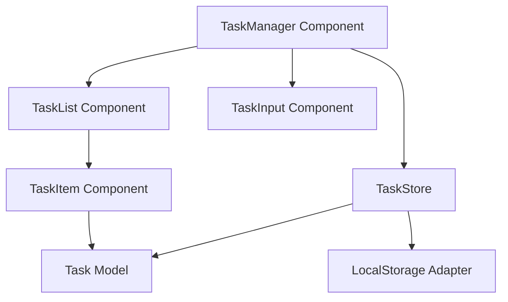

# Design Document

## Overview

This design outlines a Task Management System built as a Vue.js component that provides persistent task management functionality. The system follows a reactive architecture pattern with local storage persistence, ensuring data survives browser sessions while maintaining a responsive user interface.

The design emphasizes simplicity and reliability, using Vue's reactive system for state management and browser localStorage for persistence. The component-based architecture allows for easy integration into larger applications while maintaining clear separation of concerns.

## Architecture

The Task Management System follows a layered architecture:

1. **Presentation Layer**: Vue.js components handling user interface and interactions
2. **State Management Layer**: Reactive data store managing task state and operations
3. **Persistence Layer**: LocalStorage adapter handling data serialization and retrieval
4. **Validation Layer**: Input validation and data integrity checks

### System Components



### Data Flow

1. User interactions trigger component methods
2. Components call TaskStore operations
3. TaskStore updates reactive state
4. TaskStore persists changes via LocalStorage Adapter
5. Vue reactivity updates UI automatically

## Components and Interfaces

### TaskManager Component
- **Purpose**: Root component orchestrating the task management system
- **Responsibilities**: 
  - Initialize task store and load persisted data
  - Coordinate between input and list components
  - Handle global error states and loading indicators
- **Dependencies**: TaskStore, TaskInput, TaskList components
- **Interface**: Provides task management functionality to parent applications

### TaskInput Component
- **Purpose**: Handles task creation user interface
- **Responsibilities**: 
  - Capture user input for new tasks
  - Validate input before submission
  - Provide visual feedback for user actions
- **Dependencies**: TaskStore for task creation operations
- **Interface**: Emits task creation events and handles input validation

### TaskList Component
- **Purpose**: Displays and manages the collection of tasks
- **Responsibilities**: 
  - Render task items with proper styling
  - Handle empty state display
  - Coordinate task item interactions
- **Dependencies**: TaskStore for task data, TaskItem components
- **Interface**: Displays reactive task collection

### TaskItem Component
- **Purpose**: Individual task display and interaction
- **Responsibilities**: 
  - Display task information (description, status)
  - Handle completion toggle and deletion
  - Provide visual feedback for task states
- **Dependencies**: Task model for data structure
- **Interface**: Emits task modification events

### Interface Definitions

```typescript
interface Task {
  id: string;
  description: string;
  completed: boolean;
  createdAt: Date;
}

interface TaskStore {
  tasks: Task[];
  addTask(description: string): void;
  toggleTask(id: string): void;
  deleteTask(id: string): void;
  loadTasks(): void;
  saveTasks(): void;
}

interface LocalStorageAdapter {
  save(key: string, data: Task[]): void;
  load(key: string): Task[] | null;
  clear(key: string): void;
}
```

## Data Models

### Task Model
```typescript
interface Task {
  id: string;           // Unique identifier (UUID)
  description: string;  // Task description (1-500 characters)
  completed: boolean;   // Completion status
  createdAt: Date;     // Creation timestamp
}
```

### TaskStore State
```typescript
interface TaskStoreState {
  tasks: Task[];        // Array of all tasks
  loading: boolean;     // Loading state indicator
  error: string | null; // Error message if any
}
```

### Validation Rules
- Task descriptions must be non-empty after trimming whitespace
- Task descriptions must be between 1 and 500 characters
- Task IDs must be unique within the task list
- Creation timestamps must be valid Date objects

## Correctness Properties

*A property is a characteristic or behavior that should hold true across all valid executions of a system-essentially, a formal statement about what the system should do. Properties serve as the bridge between human-readable specifications and machine-verifiable correctness guarantees.*

Property 1: Task addition increases list size
*For any* task list and valid task description, adding the task should result in the task list length increasing by exactly one
**Validates: Requirements 1.1**

Property 2: Empty task rejection preserves state
*For any* task list and empty or whitespace-only description, attempting to add the task should leave the task list unchanged
**Validates: Requirements 1.2**

Property 3: Task completion toggle is idempotent
*For any* task, toggling completion status twice should return the task to its original completion state
**Validates: Requirements 2.1**

Property 4: Task deletion removes exactly one item
*For any* task list containing a specific task, deleting that task should result in a list with exactly one fewer item and the specified task should no longer be present
**Validates: Requirements 3.1**

Property 5: Persistence round-trip preserves data
*For any* valid task list, saving to localStorage and then loading should result in an equivalent task list with the same tasks, descriptions, and completion states
**Validates: Requirements 4.1, 4.2**

## Error Handling

### Input Validation Errors
- **Empty Task Description**: Prevent task creation and show user feedback
- **Oversized Description**: Truncate or reject descriptions exceeding character limit
- **Invalid Characters**: Sanitize input to prevent XSS or display issues

### Storage Errors
- **localStorage Unavailable**: Gracefully degrade to in-memory storage with user notification
- **Storage Quota Exceeded**: Clear old data or notify user of storage limitations
- **Corrupted Data**: Reset to empty state and log error for debugging

### System Errors
- **Component Mount Failures**: Display error boundary with recovery options
- **State Synchronization Issues**: Reload from localStorage or reset state
- **Rendering Errors**: Fallback to basic HTML rendering

### Error Recovery Strategies
- **Graceful Degradation**: Continue operating with reduced functionality when possible
- **User Notification**: Provide clear, actionable error messages
- **Automatic Recovery**: Attempt to restore from localStorage on errors
- **Fallback States**: Provide meaningful empty states and error boundaries

## Testing Strategy

### Dual Testing Approach

This feature will use both unit testing and property-based testing for comprehensive coverage:

**Unit Testing**: Validates specific examples, edge cases, and integration points between components. Unit tests verify concrete scenarios like adding specific tasks, toggling known completion states, and handling empty localStorage.

**Property-Based Testing**: Verifies universal properties that should hold across all inputs using fast-check library. Property tests will run a minimum of 100 iterations to ensure robustness across various task descriptions, list sizes, and user interaction patterns.

### Unit Testing Requirements

Unit tests will cover:
- Task creation with specific valid and invalid inputs
- Task completion toggling for known task states
- Task deletion for specific tasks in known list configurations
- localStorage integration with specific data scenarios
- Component rendering with known task data
- Error handling for specific failure conditions

### Property-Based Testing Requirements

Each correctness property will be implemented as a single property-based test using fast-check:

- **Property 1 Test**: Generate random task lists and valid descriptions, verify list size increases
- **Property 2 Test**: Generate random task lists and empty/whitespace descriptions, verify no changes
- **Property 3 Test**: Generate random tasks, toggle completion twice, verify original state
- **Property 4 Test**: Generate random task lists, delete random existing tasks, verify correct removal
- **Property 5 Test**: Generate random task lists, save and load, verify data preservation

Each property-based test will be tagged with comments explicitly referencing the correctness property:
- **Feature: task-management, Property 1: Task addition increases list size**
- **Feature: task-management, Property 2: Empty task rejection preserves state**
- **Feature: task-management, Property 3: Task completion toggle is idempotent**
- **Feature: task-management, Property 4: Task deletion removes exactly one item**
- **Feature: task-management, Property 5: Persistence round-trip preserves data**

### Test Data Generation

Property-based tests will use intelligent generators:
- **Task Descriptions**: Generate strings of varying lengths, including edge cases like whitespace-only, very long strings, and special characters
- **Task Lists**: Generate lists of varying sizes (0 to 1000 tasks) with diverse completion states
- **Task IDs**: Generate valid UUIDs and test ID uniqueness constraints
- **Timestamps**: Generate valid Date objects across different time ranges
- **Invalid Inputs**: Generate malformed data to test error handling boundaries