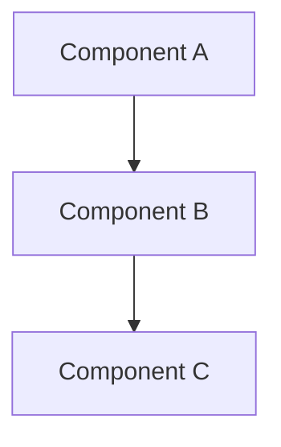

# Design Document

## Overview

[Provide a comprehensive overview of the feature design. Explain the approach, key design decisions, and how this design addresses the requirements. Include any architectural patterns or design principles being followed.]

## Architecture

[Describe the high-level architecture of the feature. Include:]
- [System components and their relationships]
- [Integration points with existing systems]
- [Data flow and control flow]
- [Architectural patterns being used]
- [Technology stack decisions and rationale]

### Architecture Diagrams

[Include Mermaid diagrams or other visual representations when appropriate]



## Components and Interfaces

### Component 1: [Component Name]
- **Purpose**: [What this component does]
- **Responsibilities**: 
  - [Primary responsibility 1]
  - [Primary responsibility 2]
- **Dependencies**: [What this component depends on]
- **Interface**: [How other components interact with this one]

### Component 2: [Component Name]
- **Purpose**: [What this component does]
- **Responsibilities**: 
  - [Primary responsibility 1]
  - [Primary responsibility 2]
- **Dependencies**: [What this component depends on]
- **Interface**: [How other components interact with this one]

### Interface Definitions

[Define key interfaces using TypeScript-style syntax or appropriate language]

```typescript
interface ComponentInterface {
  method1(param: Type): ReturnType;
  method2(param: Type): ReturnType;
}
```

## Data Models

[Define the data structures and models used by the feature]

### Primary Data Model
```typescript
interface PrimaryModel {
  id: string;
  property1: Type;
  property2: Type;
  // Additional properties
}
```

### Supporting Models
```typescript
interface SupportingModel {
  // Model definition
}
```

[Include validation rules, constraints, and relationships between models]

## Correctness Properties

*A property is a characteristic or behavior that should hold true across all valid executions of a system-essentially, a formal statement about what the system should do. Properties serve as the bridge between human-readable specifications and machine-verifiable correctness guarantees.*

[Before writing properties, complete acceptance criteria analysis to determine which are testable as properties, examples, or edge cases]

### Property 1: [Property Name]
*For any* [input domain], [property statement that should always hold true]
**Validates: Requirements [X.Y]**

### Property 2: [Property Name]
*For any* [input domain], [property statement that should always hold true]
**Validates: Requirements [X.Y]**

[Continue with additional properties...]

### Property Reflection Notes
[Document any properties that were consolidated or eliminated to avoid redundancy]

## Error Handling

[Describe how the system handles various error conditions]

### Error Categories
- **Validation Errors**: [How input validation errors are handled]
- **System Errors**: [How internal system errors are handled]
- **Integration Errors**: [How errors from external systems are handled]
- **User Errors**: [How user mistakes are handled]

### Error Recovery Strategies
- **Graceful Degradation**: [How system continues operating with reduced functionality]
- **Retry Logic**: [When and how operations are retried]
- **Fallback Mechanisms**: [Alternative approaches when primary methods fail]
- **Error Reporting**: [How errors are logged and reported to users]

## Testing Strategy

### Dual Testing Approach

This feature will use both unit testing and property-based testing for comprehensive coverage:

**Unit Testing**: Validates specific examples, edge cases, and integration points between components. Unit tests verify concrete scenarios and ensure individual components work correctly with known inputs.

**Property-Based Testing**: Verifies universal properties that should hold across all inputs using [specify PBT library, e.g., fast-check, QuickCheck, Hypothesis]. Property tests will run a minimum of 100 iterations to ensure robustness across various input combinations.

### Unit Testing Requirements

Unit tests will cover:
- [Specific functionality to be unit tested]
- [Integration points between components]
- [Edge cases and boundary conditions]
- [Error handling scenarios]

### Property-Based Testing Requirements

Each correctness property will be implemented as a single property-based test using [PBT library]:

- **Property 1 Test**: [Description of how this property will be tested]
- **Property 2 Test**: [Description of how this property will be tested]

Each property-based test will be tagged with comments explicitly referencing the correctness property:
- **Feature: [feature-name], Property 1: [property description]**
- **Feature: [feature-name], Property 2: [property description]**

Property-based tests will be configured to run 100 iterations minimum and will use intelligent generators that create realistic test data within the valid input space.

### Test Data Generation

[Describe how test data will be generated for property-based tests]
- **Input Generators**: [How valid inputs are generated]
- **Edge Case Coverage**: [How edge cases are included in generation]
- **Invalid Input Testing**: [How invalid inputs are tested for proper error handling]

---

## Template Guidelines

### Design Principles

Follow these principles when completing this template:

- **Traceability**: Every design element should trace back to specific requirements
- **Testability**: Design with testing in mind, especially property-based testing
- **Modularity**: Design components with clear boundaries and responsibilities
- **Extensibility**: Consider future enhancements and modifications
- **Performance**: Address performance considerations where relevant
- **Security**: Include security considerations for sensitive operations

### Correctness Properties Guidelines

When writing correctness properties:
- **Universal Quantification**: Each property must start with "For any..."
- **Testable Statements**: Properties must be verifiable through code
- **Requirements Traceability**: Each property must reference specific requirements
- **Avoid Redundancy**: Eliminate overlapping or redundant properties
- **Focus on Behavior**: Properties should describe what the system does, not how

### Common Property Patterns

Consider these patterns when identifying properties:
- **Invariants**: Properties that remain constant despite changes
- **Round Trip**: Combining operation with inverse returns to original
- **Idempotence**: Doing operation twice equals doing it once
- **Metamorphic**: Relationships between different inputs/outputs
- **Error Boundaries**: Proper handling of invalid inputs

### Integration Considerations

Ensure the design integrates properly with:
- **Existing Architecture**: Follows established patterns and conventions
- **Development Protocol**: Aligns with coding standards and practices
- **Build System**: Can be built and deployed with existing infrastructure
- **Testing Framework**: Compatible with existing testing approaches