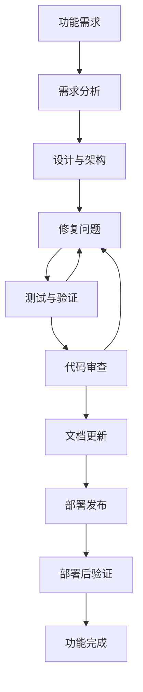

# 开发工作流程

本文档定义了 Nuxt 4 项目的开发流程、Git 工作流和提交标准。这些工作流实现了 [动态规范演进原则](./principles.md#6-动态规范演进-自我演进) 并确保整个团队的开发实践保持一致。

## 开发流程概览

### 功能开发生命周期



### 开发环境搭建

#### 前置条件
- Node.js (版本在 `.nvmrc` 中指定)
- pnpm 包管理器
- 配置正确的 Git
- 支持 TypeScript 和 Vue 的 IDE

#### 初始设置流程
1. **克隆仓库**: `git clone <repository-url>`
2. **安装依赖**: `pnpm install`
3. **环境配置**: 复制 `.env.example` 为 `.env` 并进行配置
4. **开发服务器**: `pnpm dev`
5. **验证**: 运行 `pnpm lint` 和 `pnpm build` 以确保环境正常

## Git 工作流标准

### 分支管理策略

#### 分支类型
- **`main`**: 生产分支，始终保持稳定且可部署
- **`develop`**: 开发集成分支
- **`feature/*`**: 功能开发分支
- **`hotfix/*`**: 紧急生产修复
- **`release/*`**: 发布准备分支

#### 分支命名规范
```bash
# 功能分支
feature/user-authentication
feature/payment-integration
feature/dashboard-redesign

# 修复分支
hotfix/security-patch
hotfix/critical-bug-fix

# 发布分支
release/v1.2.0
release/v2.0.0-beta
```

#### 分支工作流
1. **创建功能分支**: `git checkout -b feature/feature-name develop`
2. **开发**: 按照提交标准进行提交
3. **定期同步**: `git pull origin develop` 以保持代码最新
4. **测试**: 合并前确保所有测试通过
5. **拉取请求 (PR)**: 创建到 `develop` 分支的 PR
6. **代码审查**: 处理审查反馈
7. **合并**: 压缩并合并 (Squash and merge) 到 `develop`
8. **清理**: 合并后删除功能分支

### 提交标准

#### 提交消息格式
遵循 **Conventional Commits** (约定式提交) 规范：

```
type(scope): subject

[optional body]

[optional footer]
```

#### 提交类型
- **`feat`**: 新功能实现
- **`fix`**: bug 修复
- **`docs`**: 文档变更
- **`style`**: 代码格式化 (不涉及逻辑变更)
- **`refactor`**: 代码重构，不涉及功能变更
- **`perf`**: 性能优化
- **`test`**: 添加或修改测试
- **`chore`**: 构建流程或工具变更

#### Scope (作用域) 指南
- **`auth`**: 身份验证与授权
- **`ui`**: 用户界面组件
- **`api`**: API 端点与数据处理
- **`config`**: 配置变更
- **`build`**: 构建系统修改

#### 提交消息示例
```bash
# 良好的提交消息
feat(auth): add OAuth2 login integration
fix(ui): resolve button alignment issue in mobile view
docs(api): update authentication endpoint documentation
refactor(utils): extract common validation functions
perf(api): optimize database query performance

# 糟糕的提交消息
fix: stuff
update code
changes
WIP
```

#### 提交原则

**强制提交政策**
- **立即提交**: 完成每个逻辑工作单元后立即提交
- **原子提交**: 每个提交应代表一个逻辑变更
- **不混杂变更**: 将不相关的变更分开提交
- **提交前验证**: 确保提交前 `pnpm lint` 通过

**Windows PowerShell 命令**
```powershell
# 在 PowerShell 中正确链接命令
git add .; git commit -m "feat(ui): add new button component"
pnpm lint; pnpm build; git push origin feature/button-component
```

### 代码审查流程

#### 审查要求
- **强制审查**: 所有代码合并前必须经过审查
- **审查清单**: 使用标准化的审查清单
- **架构合规性**: 验证是否遵守 [架构标准](./architecture.md)
- **代码质量**: 确保符合 [编码规范](./coding-standards.md)

#### 审查清单
- [ ] 代码遵循既定的 [编码规范](./coding-standards.md)
- [ ] 架构符合 [项目结构](./architecture.md)
- [ ] 所有测试通过且覆盖率充足
- [ ] 新功能的文档已更新
- [ ] 未引入安全漏洞
- [ ] 性能影响在可接受范围内
- [ ] 国际化已正确实现
- [ ] 错误处理全面

## 构建与部署工作流

### 构建验证流程

#### 开发构建检查
```bash
# 要求的验证序列
pnpm lint          # ESLint + Stylelint 验证
pnpm build         # SSR/服务端构建验证
pnpm generate      # SSG 静态生成验证
```

#### 构建环境兼容性
- **Windows PowerShell**: 使用 `;` 进行命令链接，而不是 `&&`
- **跨平台**: 确保脚本在 Windows、macOS 和 Linux 上都能运行
- **CI/CD 集成**: 在自动化流水线中进行构建验证

#### 静态网站生成 (SSG)
- **主要模式**: 项目默认为 SSG 以获得最佳性能
- **配置**: 验证 `nuxt.config.ts` 中的生成设置
- **预渲染验证**: 确保所有路由都能成功生成

### 部署流程

#### 部署前清单
- [ ] 所有测试通过 (`pnpm test`)
- [ ] Lint 通过 (`pnpm lint`)
- [ ] 构建成功 (`pnpm build`)
- [ ] 静态生成正常 (`pnpm generate`)
- [ ] 环境变量已配置
- [ ] 文档已更新
- [ ] 完成安全扫描

#### 部署环境
- **开发环境**: 从 `develop` 分支自动部署
- **预发布环境 (Staging)**: 从 `release/*` 分支手动部署
- **生产环境**: 从 `main` 分支手动部署

## 文档工作流

### nikki0 文档系统

#### 文档生命周期
1. **临时日志**: 开发期间创建 `docs/_logs/temp.md`
2. **任务完成**: 使用 `nikki0` 命令归档日志
3. **分类**: 按功能和类型组织日志
4. **结构验证**: 使用 `nikki0 tree` 验证结构

#### nikki0 命令标准
```bash
# 归档开发日志
nikki0 add -p "docs/_logs/temp.md" -c "feat/editor" --tags "tiptap,editor" --title "Integrate TipTap Editor"

# 验证日志结构
nikki0 tree

# 分类命名规则 (禁止使用中文字符)
nikki0 add -c "feat/ui"           # ✅ 好
nikki0 add -c "功能/界面"          # ❌ 差 - 不允许使用中文
```

#### 文档分类
- **`feat/`**: 新功能实现
- **`fix/`**: Bug 修复与纠正
- **`refactor/`**: 代码重构
- **`docs/`**: 文档更新
- **`chore/`**: 构建与工具变更
- **`perf/`**: 性能优化

### 文档维护

#### 同步要求
- **代码-文档同步**: 保持文档随代码变更实时更新
- **Wiki 更新**: 当用法变更时更新 Material Web 组件文档
- **指南更新**: 为复杂功能维护实现指南

#### 文档类型
- **协议文档**: 核心开发标准 (本目录)
- **实现指南**: 逐步实现说明
- **API 文档**: 端点与接口文档
- **组件文档**: 组件用法与示例
- **架构文档**: 系统设计与结构

## 质量保证工作流

### 持续集成流水线 (CI Pipeline)

#### 自动化检查
```yaml
# CI 流水线阶段
- 依赖安装
- Lint 检查 (ESLint + Stylelint)
- 类型检查 (TypeScript)
- 单元测试
- 构建验证 (SSR + SSG)
- 安全扫描
- 性能测试
```

#### 质量门禁
- **Lint 门禁**: 不允许存在 lint 错误
- **类型门禁**: 不允许存在 TypeScript 错误
- **测试门禁**: 达到最低测试覆盖率阈值
- **构建门禁**: 必须成功完成构建和生成
- **安全门禁**: 无高风险漏洞

### 手动质量保证

#### 合并前验证
- [ ] 功能已通过验证
- [ ] 已测试跨浏览器兼容性
- [ ] 已验证移动端响应式
- [ ] 符合无障碍标准
- [ ] 满足性能基准测试

## 规范演进工作流

### 协议更新流程

#### 何时更新标准
- 出现新的架构模式
- 技术栈发生变更
- 团队实践演进
- 发现质量问题

#### 更新程序
1. **识别需求**: 意识到标准需要更新
2. **记录变更**: 更新相关协议文档
3. **团队审查**: 达成团队共识
4. **实施**: 应用变更到代码库
5. **验证**: 更新自动化检查
6. **沟通**: 向团队宣布变更

#### 变更文档
- **版本历史**: 在协议文档中维护变更日志
- **迁移指南**: 为采用新标准提供指导
- **原由**: 记录变更原因
- **影响评估**: 评估对现有代码的影响

### 持续改进

#### 反馈循环
- **复盘**: 定期进行团队流程有效性复盘
- **指标跟踪**: 监控开发速度和质量指标
- **工具评估**: 评估并采用新的开发工具
- **最佳实践共享**: 在团队内分享学习心得

#### 流程优化
- **自动化**: 自动化重复性任务
- **标准化**: 标准化常用工作流
- **文档化**: 保持流程文档齐全
- **培训**: 确保团队理解工作流

---

*本工作流程确保了开发实践的一致性，同时支持项目标准的 [动态演进](./principles.md#6-动态规范演进-自我演进)，并通过系统的 [验证流程](./validation.md) 保持高质量代码。*
