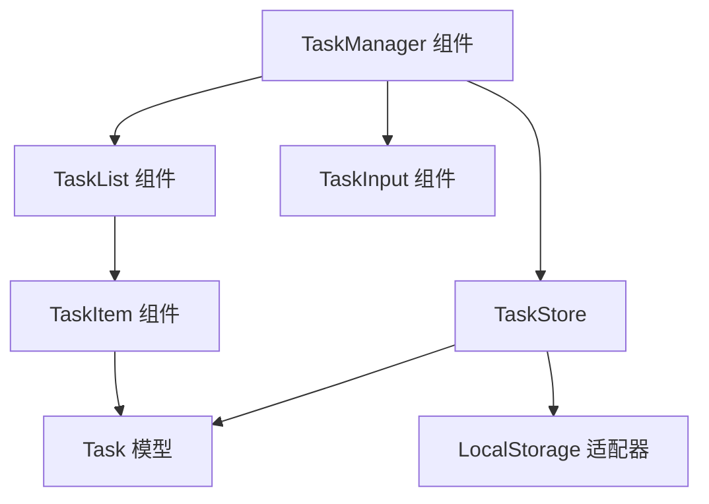

# 设计文档

## 概述

本设计概述了一个作为 Vue.js 组件构建的任务管理系统，该系统提供持久化的任务管理功能。系统遵循具有本地存储持久性的响应式架构模式，确保数据在浏览器会话之间留存，同时保持响应迅速的用户界面。

该设计强调简单性和可靠性，使用 Vue 的响应式系统进行状态管理，并使用浏览器 localStorage 进行持久化。基于组件的架构允许轻松集成到大型应用程序中，同时保持清晰的关注点分离。

## 架构

任务管理系统遵循分层架构：

1. **表现层 (Presentation Layer)**: 处理用户界面和交互的 Vue.js 组件
2. **状态管理层 (State Management Layer)**: 管理任务状态和操作的响应式数据存储
3. **持久化层 (Persistence Layer)**: 处理数据序列化和检索的 LocalStorage 适配器
4. **验证层 (Validation Layer)**: 输入验证和数据完整性检查

### 系统组件



### 数据流

1. 用户交互触发组件方法
2. 组件调用 TaskStore 操作
3. TaskStore 更新响应式状态
4. TaskStore 通过 LocalStorage 适配器持久化更改
5. Vue 响应式系统自动更新 UI

## 组件与接口

### TaskManager 组件
- **目的**: 编排任务管理系统的根组件
- **职责**: 
  - 初始化任务存储并加载持久化数据
  - 协调输入和列表组件
  - 处理全局错误状态和加载指示器
- **依赖**: TaskStore, TaskInput, TaskList 组件
- **接口**: 为父应用程序提供任务管理功能

### TaskInput 组件
- **目的**: 处理任务创建的用户界面
- **职责**: 
  - 捕获用户对新任务的输入
  - 在提交前验证输入
  - 为用户操作提供视觉反馈
- **依赖**: 用于任务创建操作的 TaskStore
- **接口**: 发出任务创建事件并处理输入验证

### TaskList 组件
- **目的**: 显示和管理任务集合
- **职责**: 
  - 使用适当的样式渲染任务项
  - 处理空状态显示
  - 协调任务项交互
- **依赖**: 任务数据的 TaskStore, TaskItem 组件
- **接口**: 显示响应式任务集合

### TaskItem 组件
- **目的**: 单个任务的显示和交互
- **职责**: 
  - 显示任务信息（描述、状态）
  - 处理完成状态切换和删除
  - 为任务状态提供视觉反馈
- **依赖**: 数据结构的 Task 模型
- **接口**: 发出任务修改事件

### 接口定义

```typescript
interface Task {
  id: string;
  description: string;
  completed: boolean;
  createdAt: Date;
}

interface TaskStore {
  tasks: Task[];
  addTask(description: string): void;
  toggleTask(id: string): void;
  deleteTask(id: string): void;
  loadTasks(): void;
  saveTasks(): void;
}

interface LocalStorageAdapter {
  save(key: string, data: Task[]): void;
  load(key: string): Task[] | null;
  clear(key: string): void;
}
```

## 数据模型

### Task 模型
```typescript
interface Task {
  id: string;           // 唯一标识符 (UUID)
  description: string;  // 任务描述 (1-500 字符)
  completed: boolean;   // 完成状态
  createdAt: Date;     // 创建时间戳
}
```

### TaskStore 状态
```typescript
interface TaskStoreState {
  tasks: Task[];        // 所有任务的数组
  loading: boolean;     // 加载状态指示器
  error: string | null; // 错误消息（如果有）
}
```

### 验证规则
- 任务描述在去除首尾空格后必须非空
- 任务描述必须在 1 到 500 个字符之间
- 任务 ID 在任务列表中必须唯一
- 创建时间戳必须是有效的 Date 对象

## 正确性属性 (Correctness Properties)

*属性是在系统的所有有效执行中都应保持为真的特征或行为——本质上，是关于系统应该做什么的正式陈述。属性充当了人类可读的规格说明与机器可验证的正确性保证之间的桥梁。*

属性 1: 添加任务会增加列表大小
*对于任何* 任务列表和有效的任务描述，添加任务应导致任务列表长度精确增加 1
**验证需求: 1.1**

属性 2: 拒绝空任务会保留状态
*对于任何* 任务列表和空或仅含空格的描述，尝试添加任务应使任务列表保持不变
**验证需求: 1.2**

属性 3: 任务完成状态切换是幂等的
*对于任何* 任务，切换两次完成状态应使任务返回其原始完成状态
**验证需求: 2.1**

属性 4: 删除任务会精确移除一项
*对于任何* 包含特定任务的任务列表，删除该任务应导致列表项精确减少一项，且指定的任务不再存在
**验证需求: 3.1**

属性 5: 持久化往返会保留数据
*对于任何* 有效的任务列表，保存到 localStorage 然后加载应产生一个等效的任务列表，具有相同的任务、描述和完成状态
**验证需求: 4.1, 4.2**

## 错误处理

### 输入验证错误
- **空任务描述**: 阻止任务创建并显示用户反馈
- **描述过长**: 截断或拒绝超过字符限制的描述
- **无效字符**: 清理输入以防止 XSS 或显示问题

### 存储错误
- **localStorage 不可用**: 优雅降级到内存存储并通知用户
- **存储配额超出**: 清除旧数据或通知用户存储限制
- **数据损坏**: 重置为空状态并记录错误以供调试

### 系统错误
- **组件挂载失败**: 显示带有恢复选项的错误边界
- **状态同步问题**: 从 localStorage 重新加载或重置状态
- **渲染错误**: 回退到基础 HTML 渲染

### 错误恢复策略
- **优雅降级**: 在可能的情况下继续以受限功能运行
- **用户通知**: 提供清晰、可操作的错误消息
- **自动恢复**: 出错时尝试从 localStorage 恢复
- **回退状态**: 提供有意义的空状态和错误边界

## 测试策略

### 双重测试方法

该功能将同时使用单元测试和基于属性的测试 (Property-Based Testing) 以实现全面覆盖：

**单元测试**: 验证特定示例、边缘情况和组件之间的集成点。单元测试验证具体场景，如添加特定任务、切换已知完成状态以及处理空 localStorage。

**基于属性的测试 (PBT)**: 使用 fast-check 库验证在所有输入下都应保持为真的通用属性。属性测试将运行至少 100 次迭代，以确保在各种任务描述、列表大小和用户交互模式下的鲁棒性。

### 单元测试要求

单元测试将覆盖：
- 具有特定有效和无效输入的任务创建
- 已知任务状态的任务完成切换
- 已知列表配置中特定任务的任务删除
- 具有特定数据场景的 localStorage 集成
- 具有已知任务数据的组件渲染
- 特定失败情况的错误处理

### 基于属性的测试要求

每个正确性属性都将使用 fast-check 实现为单个基于属性的测试：

- **属性 1 测试**: 生成随机任务列表和有效描述，验证列表大小增加
- **属性 2 测试**: 生成随机任务列表和空/空格描述，验证无变化
- **属性 3 测试**: 生成随机任务，切换两次完成状态，验证原始状态
- **属性 4 测试**: 生成随机任务列表，删除随机现有任务，验证正确移除
- **属性 5 测试**: 生成随机任务列表，保存并加载，验证数据保留

每个基于属性的测试都将标记有明确引用正确性属性的注释：
- **Feature: task-management, Property 1: 任务添加增加列表大小**
- **Feature: task-management, Property 2: 拒绝空任务保留状态**
- **Feature: task-management, Property 3: 任务完成切换是幂等的**
- **Feature: task-management, Property 4: 删除任务精确移除一项**
- **Feature: task-management, Property 5: 持久化往返保留数据**

### 测试数据生成

基于属性的测试将使用智能生成器：
- **任务描述**: 生成不同长度的字符串，包括边缘情况（如仅含空格、超长字符串和特殊字符）
- **任务列表**: 生成不同大小（0 到 1000 个任务）且具有多样完成状态的列表
- **任务 ID**: 生成有效的 UUID 并测试 ID 唯一性约束
- **时间戳**: 生成不同时间范围内的有效 Date 对象
- **无效输入**: 生成格式错误的数据以测试错误处理边界
