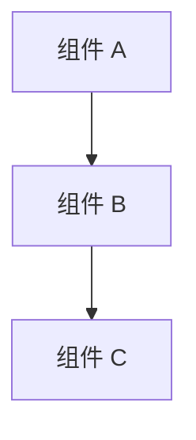

# 设计文档

## 概述

[提供功能设计的全面概述。说明方法、关键设计决策以及此设计如何满足需求。包括遵循的任何架构模式或设计原则。]

## 架构

[描述功能的高层架构。包括：]
- [系统组件及其关系]
- [与现有系统的集成点]
- [数据流和控制流]
- [正在使用的架构模式]
- [技术栈决策及理由]

### 架构图

[在适当情况下包括 Mermaid 图表或其他视觉表示]



## 组件与接口

### 组件 1: [组件名称]
- **目的**: [该组件的作用]
- **职责**: 
  - [主要职责 1]
  - [主要职责 2]
- **依赖**: [该组件依赖的内容]
- **接口**: [其他组件如何与该组件交互]

### 组件 2: [组件名称]
- **目的**: [该组件的作用]
- **职责**: 
  - [主要职责 1]
  - [主要职责 2]
- **依赖**: [该组件依赖的内容]
- **接口**: [其他组件如何与该组件交互]

### 接口定义

[使用 TypeScript 风格的语法或适当的语言定义关键接口]

```typescript
interface ComponentInterface {
  method1(param: Type): ReturnType;
  method2(param: Type): ReturnType;
}
```

## 数据模型

[定义功能使用的数据结构和模型]

### 主要数据模型
```typescript
interface PrimaryModel {
  id: string;
  property1: Type;
  property2: Type;
  // 其他属性
}
```

### 辅助模型
```typescript
interface SupportingModel {
  // 模型定义
}
```

[包括验证规则、约束以及模型之间的关系]

## 正确性属性 (Correctness Properties)

*属性是在系统的所有有效执行中都应保持为真的特征或行为——本质上，是关于系统应该做什么的正式陈述。属性充当了人类可读的规格说明与机器可验证的正确性保证之间的桥梁。*

[在编写属性之前，完成验收标准分析，以确定哪些可以作为属性、示例或边缘情况进行测试]

### 属性 1: [属性名称]
*对于任何* [输入域]，[始终保持为真的属性陈述]
**验证需求: [X.Y]**

### 属性 2: [属性名称]
*对于任何* [输入域]，[始终保持为真的属性陈述]
**验证需求: [X.Y]**

[继续添加其他属性...]

### 属性反射说明
[记录为避免冗余而合并或消除的任何属性]

## 错误处理

[描述系统如何处理各种错误情况]

### 错误分类
- **验证错误**: [如何处理输入验证错误]
- **系统错误**: [如何处理内部系统错误]
- **集成错误**: [如何处理来自外部系统的错误]
- **用户错误**: [如何处理用户的错误操作]

### 错误恢复策略
- **优雅降级**: [系统如何在功能受限的情况下继续运行]
- **重试逻辑**: [何时以及如何重试操作]
- **回退机制**: [主方法失败时的替代方案]
- **错误报告**: [如何记录错误并向用户报告]

## 测试策略

### 双重测试方法

该功能将同时使用单元测试和基于属性的测试 (Property-Based Testing) 以实现全面覆盖：

**单元测试**: 验证特定示例、边缘情况和组件之间的集成点。单元测试验证具体场景，并确保单个组件在已知输入下正确工作。

**基于属性的测试 (PBT)**: 使用 [指定 PBT 库，例如 fast-check, QuickCheck, Hypothesis] 验证在所有输入下都应保持为真的通用属性。属性测试将运行至少 100 次迭代，以确保在各种输入组合下的鲁棒性。

### 单元测试要求

单元测试将覆盖：
- [要进行单元测试的具体功能]
- [组件之间的集成点]
- [边缘情况和边界条件]
- [错误处理场景]

### 基于属性的测试要求

每个正确性属性都将使用 [PBT 库] 实现为单个基于属性的测试：

- **属性 1 测试**: [描述如何测试该属性]
- **属性 2 测试**: [描述如何测试该属性]

每个基于属性的测试都将标记有明确引用正确性属性的注释：
- **Feature: [功能名称], Property 1: [属性描述]**
- **Feature: [功能名称], Property 2: [属性描述]**

基于属性的测试将配置为至少运行 100 次迭代，并将使用智能生成器，在有效输入空间内创建真实的测试数据。

### 测试数据生成

[描述如何为基于属性的测试生成测试数据]
- **输入生成器**: [如何生成有效输入]
- **边缘情况覆盖**: [如何在生成中包含边缘情况]
- **无效输入测试**: [如何测试无效输入以确保正确的错误处理]

---

## 模板指南

### 设计原则

完成此模板时请遵循以下原则：

- **可追溯性**: 每个设计元素都应追溯到特定需求
- **可测试性**: 在设计时考虑测试，特别是基于属性的测试
- **模块化**: 设计具有清晰边界和职责的组件
- **可扩展性**: 考虑未来的增强和修改
- **性能**: 在相关处解决性能考虑
- **安全性**: 为敏感操作包含安全性考虑

### 正确性属性指南

编写正确性属性时：
- **全称量化**: 每个属性必须以“对于任何...”开头
- **可测试陈述**: 属性必须可通过代码进行验证
- **需求可追溯性**: 每个属性必须引用特定需求
- **避免冗余**: 消除重叠或冗余的属性
- **关注行为**: 属性应描述系统做什么，而不是如何做

### 常见属性模式

识别属性时考虑以下模式：
- **不变性**: 尽管发生变化但仍保持不变的属性
- **往返 (Round Trip)**: 将操作与其逆操作结合后返回原始状态
- **幂等性**: 执行两次操作等于执行一次
- **变形 (Metamorphic)**: 不同输入/输出之间的关系
- **错误边界**: 对无效输入的正确处理

### 集成注意事项

确保设计与以下各项正确集成：
- **现有架构**: 遵循既定的模式和规范
- **开发协议**: 符合编码标准和实践
- **构建系统**: 可以使用现有基础设施进行构建和部署
- **测试框架**: 与现有的测试方法兼容
